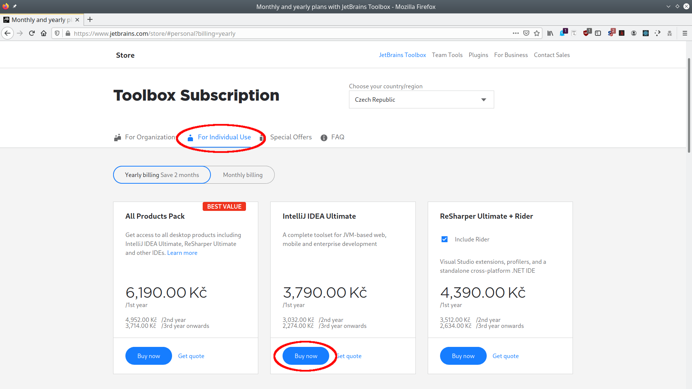
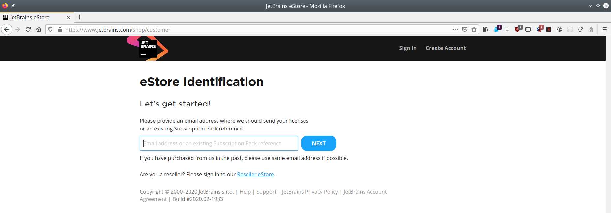
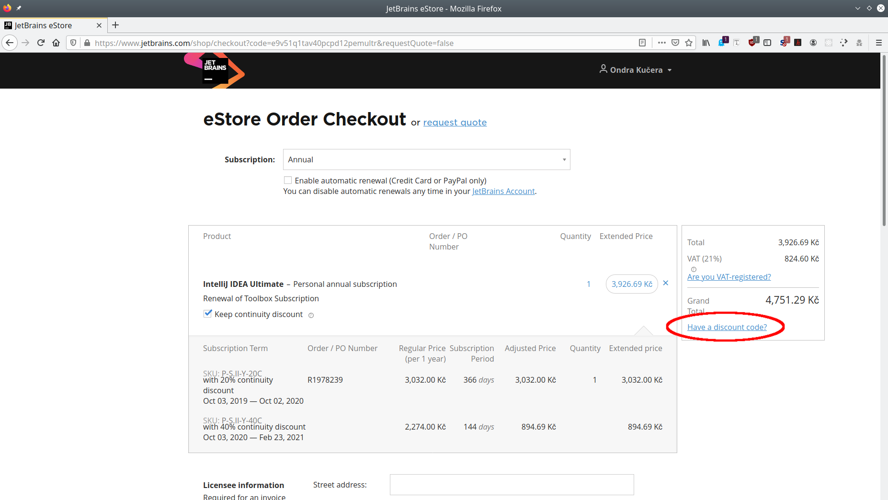
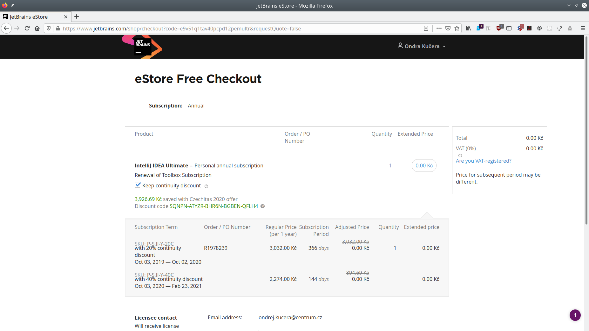
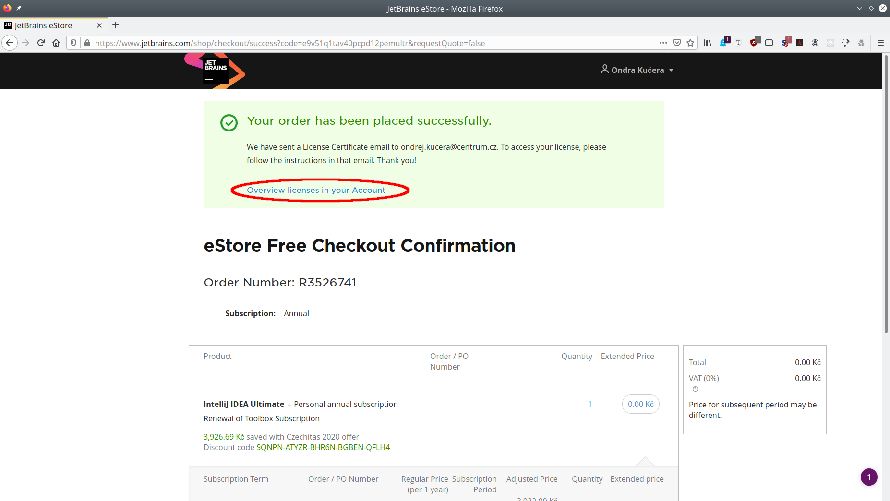
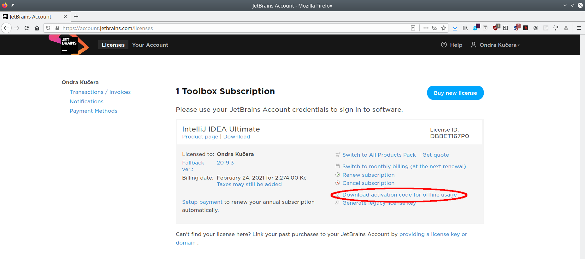
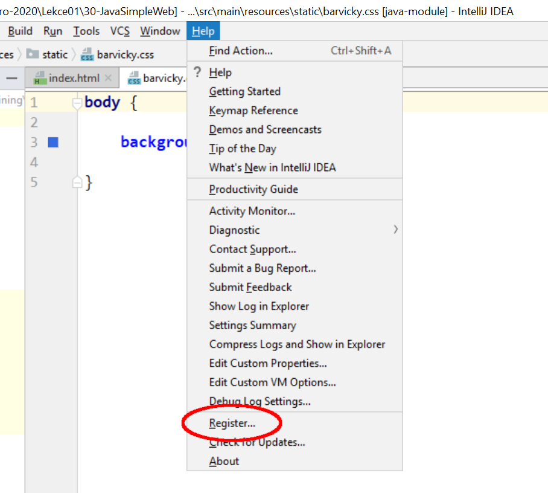
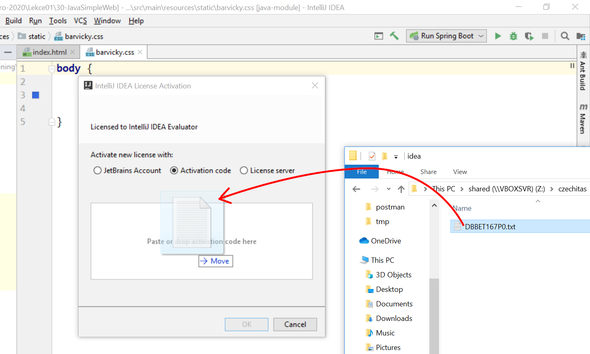
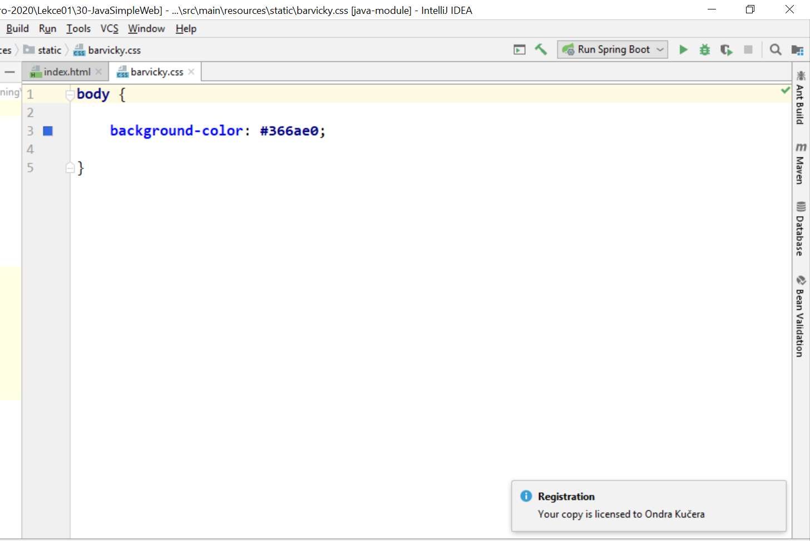
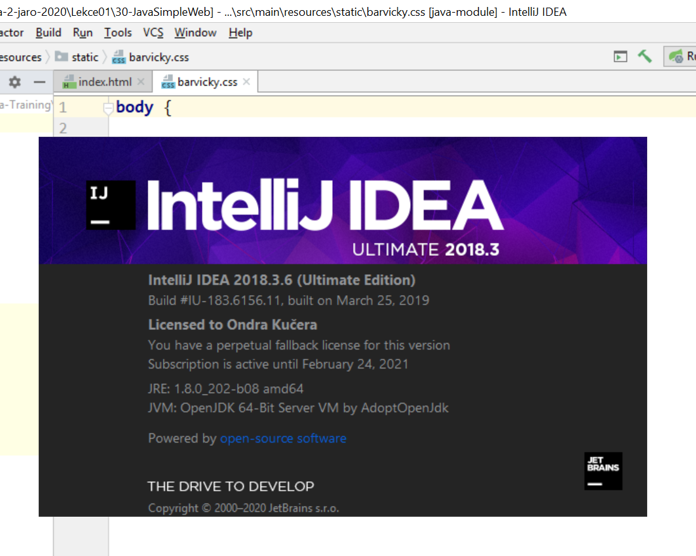

Úkol 00 - Registrace IntelliJ IDEA
----------------------------------

Cílem domácího úkolu je zaregistrovat si IntelliJ IDEA, abychom s ní mohli dále nerušeně pracovat.

Registraci je potřeba provést v několika krocích: nejprve je potřeba aplikaci s použitím 100% slevového kupónu zakoupit
v e-shopu a následně je možné použít vygenerovanou licenci k samotné registraci.

## Získání slevového kupónu

Každá účastnice jste dostala přidělen slevový kupón. Naleznete jej v tabulce s přehledem odevzdaných domácích úkolů.

## Zakoupení IntelliJ IDEA

Přejděte do obchodu JetBrains na adrese https://www.jetbrains.com/store/, v něm vyberte záložku *For Individual Use* a
mezi možnými produkty *IntelliJ IDEA Ultimate*. Stiskněte tlačítko *Buy now*.

Na příští obrazovce zvolte e-mail, na který bude firma JetBrains posílat informace s pořízenou licencí související.

Pokud jste se v minulosti ještě v tomto obchodu neregistrovaly (je pravděpodobné, že ne), budete si muset založit nový
účet a přihlásit se k němu. K této fázi doprovodné obrázky nemáme, ale jistě to zvládnete samy. :-)

Následně byste se měly ocitnout na stránce s objednávkou produktu (pokud ne, zkuste jej znovu vyhledat a znovu zvolit
jeho nákup). Zde klikněte na odkaz *Have a discount code?* a do políčka, které se objeví, zkopírujte svůj kupón.

Po potvrzení by mělo dojít k přepočítání ceny na 0 Kč.

Nyní můžete nákup bez obav potvrdit. :-) Následně klikněte na odkaz *Overview licenses in your Account*.

## Registrace

V tuto chvíli existuje více způsobů, jak licenci použít. Popíšeme způsob ne nezbytně nejjednodušší, ale každopádně
ověřený. Klikněte na odkaz *Download activation code for offline usage* a nabídnutý soubor si uložte.

Spusťte IntelliJ IDEA a zvolte v menu *Help* položku *Register...*.

Zvolte možnost *Activation code* a soubor s licencí přetáhněte do určeného pole.

Ihned byste se měly dozvědět, že IDEA je zaregistrována.

Informaci o úspěšné registraci si i kdykoliv později zobrazíte v menu *Help* volbou *About*.

## Odevzdání domácího úkolu

Teto úkol je svým charakterem značně netypický, nebudete tedy pochopitelně odevzdávat žádnou vytvořenou aplikaci. Vaším
úkolem je jediné: do galerie `Úkol 0` na Facebooku umístit screenshot právě výše zmíněného okénka *About*, ze kterého
bude vidět, že jste registraci úspěšně dokončily.

Termín odevzdání je dva dny před další lekcí, nejpozději 23:59.
Tedy pokud je další lekce ve čtvrtek, termín je úterý 23:59.
Pokud úkol nebo revizi odevzdáte později,
prosím pošlete svému opravujícímu kouči/lektorovi email nebo zprávu přes FB.
